# Raport
Piotr Konowalski  
`r format(Sys.time(), '%d %B, %Y')`  


##Podsumowanie analizy
Analiza otrzymanych danych była procesem wieloetapowym. Ze względu na znaczną liczbę pustych wartości konieczne okazało się poradzenie sobie z tym problemem przed podjęciem kolejnych kroków. Niekompletne przypadki dopasowano do najbardziej im podobnych i na tej podstawie uzupełniono brakujące wartości. W ogólności dane wzbudzają pewne podejrzenia co do swojej autentyczności, dlatego też wynik analizy może nie być w pełni zgodny z rzeczywistymi obserwacjami. W ramach projektu przeprowadzono liczne próby przekształcenia danych do postaci bardziej czytelnej i łatwiejszej w analizie. Ostatecznie utworzono regresor przewidujący rozmiar śledzia i na jego podstawie wyznaczono atrybuty mające największy wpływ na spadek rozmiaru śledzia oceanicznego w ostatnich latach. Z analizy wynika, że najbardziej prawdopodobną przyczyną takiego stanu rzeczy jest podnosząca się temperatura przy powierzchni wody.

##Opis danych
Na przestrzeni ostatnich lat zauważono stopniowy spadek rozmiaru śledzia oceanicznego wyławianego w Europie. Do analizy zebrano pomiary śledzi i warunków w jakich żyją z ostatnich 60 lat. Dane były pobierane z połowów komercyjnych jednostek. W ramach połowu jednej jednostki losowo wybierano od 50 do 100 sztuk trzyletnich śledzi. Dane dostępne są pod adresem: http://www.cs.put.poznan.pl/dbrzezinski/teaching/zed/sledzie.csv.

Kolejne kolumny w zbiorze danych to:

* X: numer wiersza
* length: długość złowionego śledzia [cm];
* cfin1: dostępność planktonu [zagęszczenie Calanus finmarchicus gat. 1];
* cfin2: dostępność planktonu [zagęszczenie Calanus finmarchicus gat. 2];
* chel1: dostępność planktonu [zagęszczenie Calanus helgolandicus gat. 1];
* chel2: dostępność planktonu [zagęszczenie Calanus helgolandicus gat. 2];
* lcop1: dostępność planktonu [zagęszczenie widłonogów gat. 1];
* lcop2: dostępność planktonu [zagęszczenie widłonogów gat. 2];
* fbar: natężenie połowów w regionie [ułamek pozostawionego narybku];
* recr: roczny narybek [liczba śledzi];
* cumf: łączne roczne natężenie połowów w regionie [ułamek pozostawionego narybku];
* totaln: łączna liczba ryb złowionych w ramach połowu [liczba śledzi];
* sst: temperatura przy powierzchni wody [°C];
* sal: poziom zasolenia wody [Knudsen ppt];
* xmonth: miesiąc połowu [numer miesiąca];
* nao: oscylacja północnoatlantycka [mb].

Wiersze w zbiorze są uporządkowane chronologicznie.

##Uzupełnienie brakujących danych
W celu uzupełnienia pustych wartości posłużono się obseracją, iż wiele wierszy danych wielokrotnie się powtarza. Na przykład wiesze z przedziału 0-282 (z pominięciem kolumn X, length i xmonth) są identyczne. Ta tendencja utrzymuje się w całym zbiorze danych. Co najbardziej zaskakujące powtarzające się dane występują nie tylko zaraz po sobie, ale również w znacznych odstepach - biorąc pod uwagę fakt, że dane pochodzą z 60 lat - nawet w odstępach wieloletnich. 

Wykorzystując ten fakt postanowiono pogrupować dane korzystając z następujących kolumn: cfin1, cfin2, chel1, chel2, lcop1, lcop2, fbar, recr, cumf, totaln, sst, sal, nao (wszystkie atrybuty oprócz X, length i xmonth).


```r
dtc <- dt[complete.cases(dt), ]
grouped <- dtc %>% 
  group_by(cfin1, cfin2, chel1, chel2, lcop1, lcop2, fbar, recr, cumf, totaln, sst, sal, nao) %>% 
  summarise(length=mean(length), n=max(X)) %>% 
  select(c(n, length, everything()))
```

Po wykonaniu grupowania otrzymano 106 wierszy. Następnie utworzono dwie funkcje: 

* filled - uzupełnianie wartości pustych w ramach pojedynczego wiersza na podstawie danych ze zgupowanej kolekcji 
* substituteNA - wywoływanie w pętli dla wszystkch wierszy zawierających puste dane funkcji filled


```r
filled <- function(row){
  v <- select(row, -X, -xmonth, -length)
  v <- unlist(v)
  notNaNames <- names(v[!is.na(v)])
  naNames <- names(v[is.na(v)])
  semi_join(grouped, row, by=notNaNames)
}

substituteNA <- function(tab){
  for(i in 1:nrow(tab)){
    row <- tab[i,]
    if(anyNA(row)){
        v <- unlist(row)
        naNames <- names(v[is.na(v)])
        tab[i, naNames] <- filled(row)[1, naNames]
    }
  }
  tab
}
```

Po uruchomieniu funkcji substituteNA na danych wszystkie wartości puste zostały uzupełnione


```r
dt <- substituteNA(dt)
```

##Podsumowanie zbioru i podstawowe statystyki


```r
kable(summary(dt[,1:8]))
```

           X             length         cfin1             cfin2             chel1            chel2            lcop1              lcop2      
---  --------------  -------------  ----------------  ----------------  ---------------  ---------------  -----------------  ---------------
     Min.   :    0   Min.   :19.0   Min.   : 0.0000   Min.   : 0.0000   Min.   : 0.000   Min.   : 5.238   Min.   :  0.3074   Min.   : 7.849 
     1st Qu.:13145   1st Qu.:24.0   1st Qu.: 0.0000   1st Qu.: 0.2778   1st Qu.: 2.469   1st Qu.:13.427   1st Qu.:  2.5479   1st Qu.:17.808 
     Median :26291   Median :25.5   Median : 0.1111   Median : 0.7012   Median : 5.750   Median :21.435   Median :  7.0000   Median :24.859 
     Mean   :26291   Mean   :25.3   Mean   : 0.4460   Mean   : 2.0257   Mean   :10.001   Mean   :21.219   Mean   : 12.8058   Mean   :28.422 
     3rd Qu.:39436   3rd Qu.:26.5   3rd Qu.: 0.3333   3rd Qu.: 1.7936   3rd Qu.:11.500   3rd Qu.:27.193   3rd Qu.: 21.2315   3rd Qu.:37.232 
     Max.   :52581   Max.   :32.5   Max.   :37.6667   Max.   :19.3958   Max.   :75.000   Max.   :57.706   Max.   :115.5833   Max.   :68.736 

```r
kable(summary(dt[,9:16]))
```

          fbar             recr              cumf             totaln             sst             sal            xmonth            nao         
---  ---------------  ----------------  ----------------  ----------------  --------------  --------------  ---------------  -----------------
     Min.   :0.0680   Min.   : 140515   Min.   :0.06833   Min.   : 144137   Min.   :12.77   Min.   :35.40   Min.   : 1.000   Min.   :-4.89000 
     1st Qu.:0.2270   1st Qu.: 360061   1st Qu.:0.14809   1st Qu.: 306068   1st Qu.:13.60   1st Qu.:35.51   1st Qu.: 5.000   1st Qu.:-1.89000 
     Median :0.3320   Median : 421391   Median :0.23191   Median : 539558   Median :13.86   Median :35.51   Median : 8.000   Median : 0.20000 
     Mean   :0.3304   Mean   : 520367   Mean   :0.22981   Mean   : 514973   Mean   :13.87   Mean   :35.51   Mean   : 7.258   Mean   :-0.09236 
     3rd Qu.:0.4560   3rd Qu.: 724151   3rd Qu.:0.29803   3rd Qu.: 730351   3rd Qu.:14.16   3rd Qu.:35.52   3rd Qu.: 9.000   3rd Qu.: 1.63000 
     Max.   :0.8490   Max.   :1565890   Max.   :0.39801   Max.   :1015595   Max.   :14.73   Max.   :35.61   Max.   :12.000   Max.   : 5.08000 

##Dodanie atrybutu period
Ze względu na obserwację poczynioną przy uzupełnianiu brakujących wartości związaną ze znaczną liczbą powtarzających się wartości podjęto próbę uzupełnienia danych o sztuczną kolumnę "period". Ponieważ w danych brakuje kolumny przechowującej informację o roku pobrania próbki postanowiono wprowadzić atrybut definiujący okres, w którym dokonano obserwacji. Nie będzie to oczywiście atrybut o identycznym rozkładzie co potencjalny rok, ale może on się okazać bardzo przydatny w dalszej analizie i wizualizacji danych.

W tym celu utworzono funkcję addPeriod:


```r
addPeriod <- function(tab){
  compareNames <- names(tab[0,] %>% select(-X, -length, -xmonth))
  current <- unlist(tab[1,][compareNames])
  period <- 1
  periodCol <- c()
  
  for(i in 1:nrow(tab)){
    row <- tab[i,]
    compareRow <- unlist(row[compareNames])
    if(!identical(current, compareRow)){
        current <- compareRow
        period <- period + 1
    }
    
    periodCol <- c(periodCol, period)
  }
  
  withPeriod <- cbind(tab, period=periodCol)
  withPeriod
}

dt <- addPeriod(dt)
```

Wartość atrybutu period jest ustalana przez ciąg powtarzających się bezpośrednio po sobie takich samych wierszy (z pominięciem kolumn X, length oraz xmonth). W momencie, gdy którakolwiek z wartości w wierszu się zmieni tworzony jest kolejny okres.

Po uruchomieniu funkcji na zbiorze danych otrzymano 2627 okresów

##Szczegółowa analiza wartości atrybutów

### length - długość śledzia z uwzględnieniem okresu
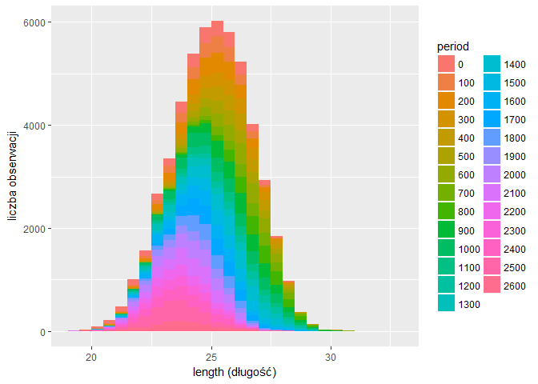<!-- -->

Na powyższym wykresie można z łatwością zauważyć że rozkład długości śledzia przesuwa się w lewo wraz z upływem czasu.

###cfin1: dostępność planktonu [zagęszczenie Calanus finmarchicus gat. 1]
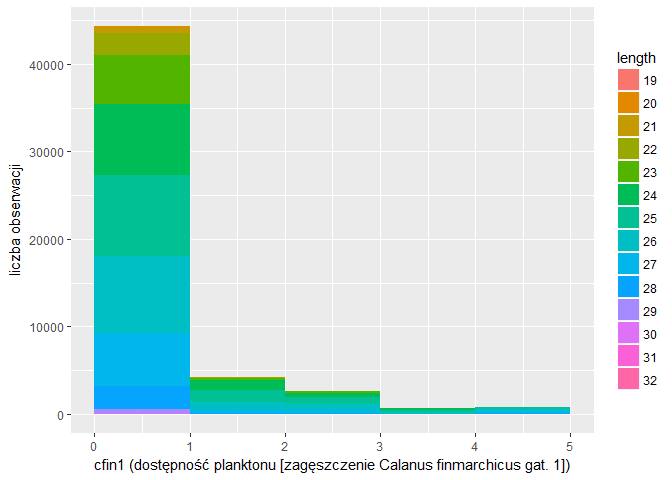<!-- -->

###cfin2: dostępność planktonu [zagęszczenie Calanus finmarchicus gat. 2]
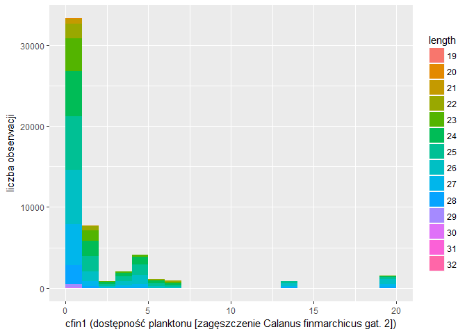<!-- -->

###chel1: dostępność planktonu [zagęszczenie Calanus helgolandicus gat. 1]
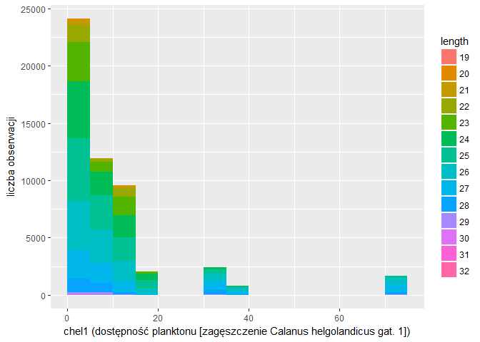<!-- -->

###chel2: dostępność planktonu [zagęszczenie Calanus helgolandicus gat. 2]
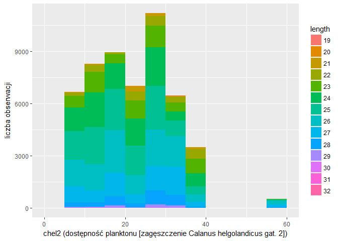<!-- -->

###lcop1: dostępność planktonu [zagęszczenie widłonogów gat. 1]
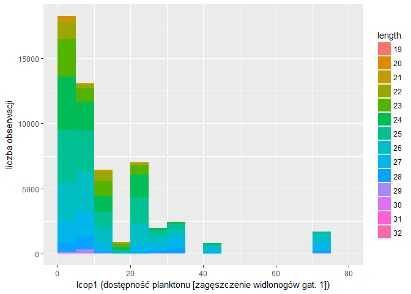<!-- -->

###lcop2: dostępność planktonu [zagęszczenie widłonogów gat. 2]
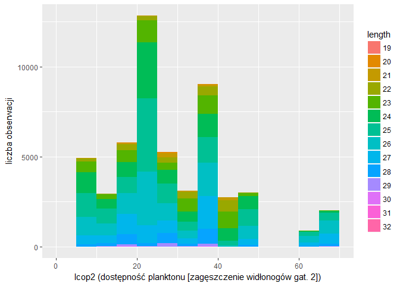<!-- -->

###fbar: natężenie połowów w regionie [ułamek pozostawionego narybku]
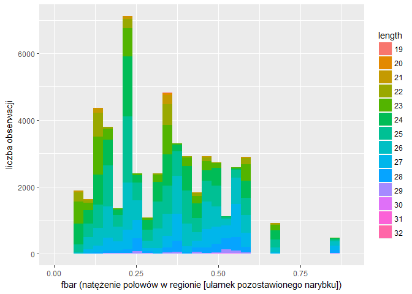<!-- -->

###recr: roczny narybek [liczba śledzi]
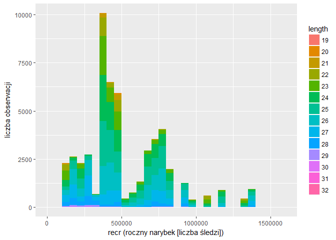<!-- -->

###cumf: łączne roczne natężenie połowów w regionie [ułamek pozostawionego narybku]
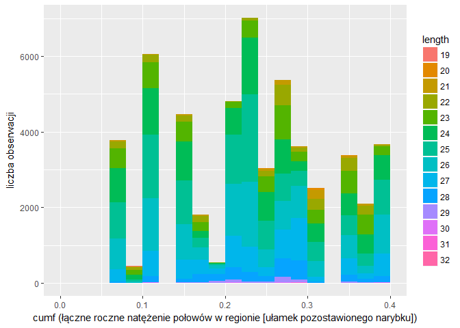<!-- -->

###totaln: łączna liczba ryb złowionych w ramach połowu [liczba śledzi]
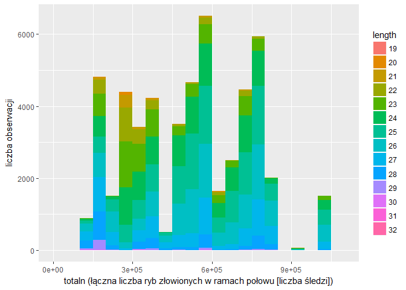<!-- -->

###sst: temperatura przy powierzchni wody [°C]
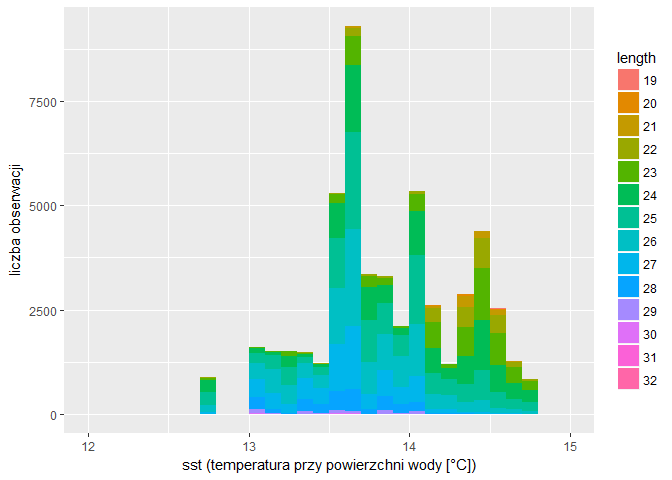<!-- -->

###sal: poziom zasolenia wody [Knudsen ppt]
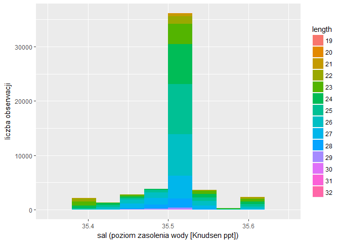<!-- -->

###xmonth: miesiąc połowu [numer miesiąca]
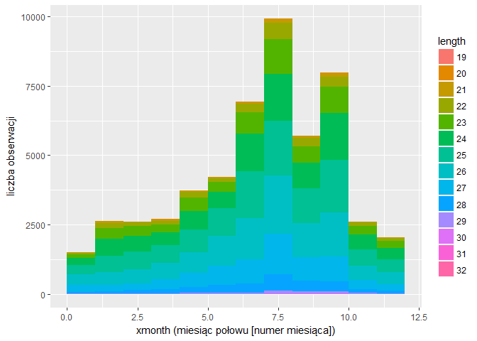<!-- -->

###nao: oscylacja północnoatlantycka [mb]
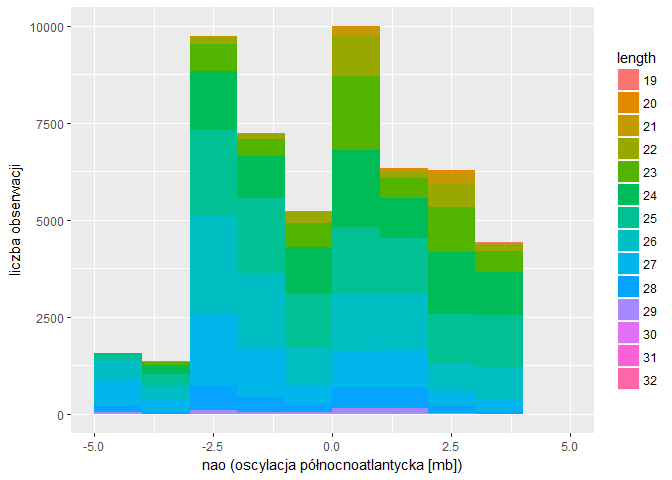<!-- -->

##Korelacja

###Macierz korelacji


          length   cfin1   cfin2   chel1   chel2   lcop1   lcop2    fbar    recr    cumf   totaln     sst     sal     nao   period
-------  -------  ------  ------  ------  ------  ------  ------  ------  ------  ------  -------  ------  ------  ------  -------
length      1.00    0.08    0.10    0.22   -0.01    0.24    0.05    0.25   -0.01    0.01     0.10   -0.45    0.03   -0.26    -0.35
cfin1       0.08    1.00    0.15    0.09    0.20    0.12    0.21   -0.06    0.12   -0.05     0.13    0.01    0.13    0.01    -0.15
cfin2       0.10    0.15    1.00    0.00    0.31   -0.04    0.65    0.15   -0.10    0.34    -0.22   -0.24   -0.08   -0.01     0.05
chel1       0.22    0.09    0.00    1.00    0.29    0.96    0.25    0.16   -0.05    0.07     0.17   -0.22   -0.15   -0.51    -0.17
chel2      -0.01    0.20    0.31    0.29    1.00    0.18    0.89    0.03    0.00    0.26    -0.38    0.01   -0.22   -0.06     0.06
lcop1       0.24    0.12   -0.04    0.96    0.18    1.00    0.15    0.10    0.00   -0.01     0.27   -0.26   -0.10   -0.55    -0.24
lcop2       0.05    0.21    0.65    0.25    0.89    0.15    1.00    0.05    0.00    0.29    -0.30   -0.12   -0.19   -0.05     0.04
fbar        0.25   -0.06    0.15    0.16    0.03    0.10    0.05    1.00   -0.24    0.82    -0.51   -0.18    0.04    0.07     0.09
recr       -0.01    0.12   -0.10   -0.05    0.00    0.00    0.00   -0.24    1.00   -0.26     0.37   -0.20    0.28    0.09     0.00
cumf        0.01   -0.05    0.34    0.07    0.26   -0.01    0.29    0.82   -0.26    1.00    -0.71    0.03   -0.10    0.23     0.23
totaln      0.10    0.13   -0.22    0.17   -0.38    0.27   -0.30   -0.51    0.37   -0.71     1.00   -0.29    0.15   -0.39    -0.36
sst        -0.45    0.01   -0.24   -0.22    0.01   -0.26   -0.12   -0.18   -0.20    0.03    -0.29    1.00    0.01    0.51     0.38
sal         0.03    0.13   -0.08   -0.15   -0.22   -0.10   -0.19    0.04    0.28   -0.10     0.15    0.01    1.00    0.13    -0.05
nao        -0.26    0.01   -0.01   -0.51   -0.06   -0.55   -0.05    0.07    0.09    0.23    -0.39    0.51    0.13    1.00     0.42
period     -0.35   -0.15    0.05   -0.17    0.06   -0.24    0.04    0.09    0.00    0.23    -0.36    0.38   -0.05    0.42     1.00

### Korelacja: length-cfin1 (-0.45)

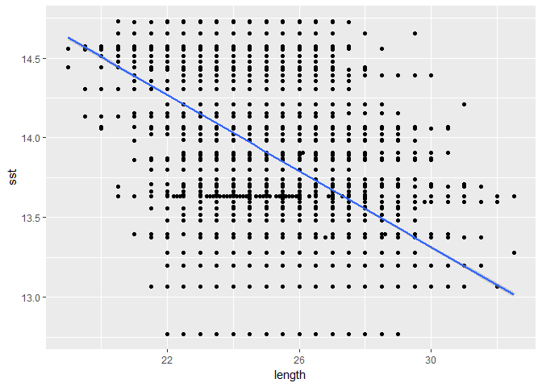<!-- -->

### Korelacja: cfin2-lcop2 (0.65)

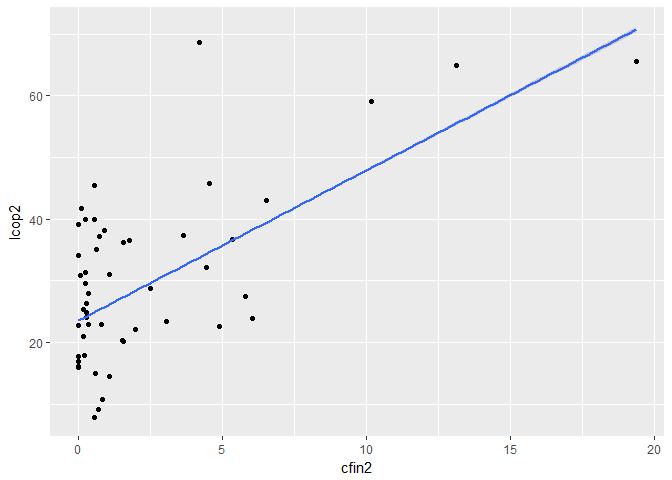<!-- -->

### Korelacja: chel1-lcop1 (0.96)

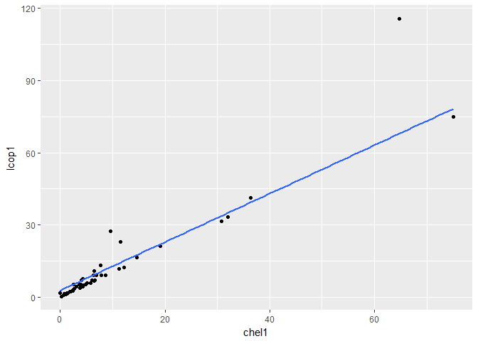<!-- -->

### Korelacja: chel1-nao (-0.51)

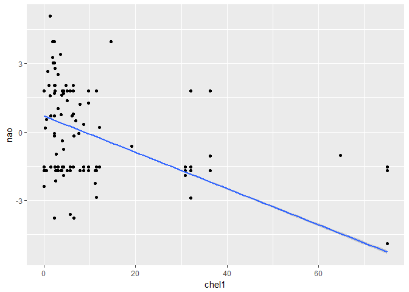<!-- -->

### Korelacja: lcop1-nao (-0.55)

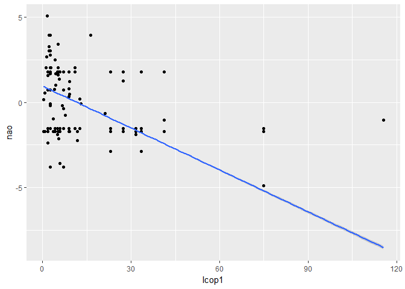<!-- -->

### Korelacja: sst-nao (0.51)

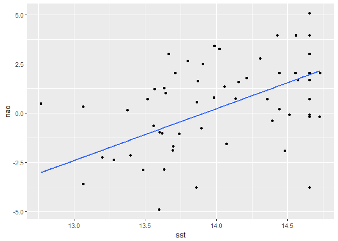<!-- -->

### Korelacja: chel2-lcop2 (0.89)

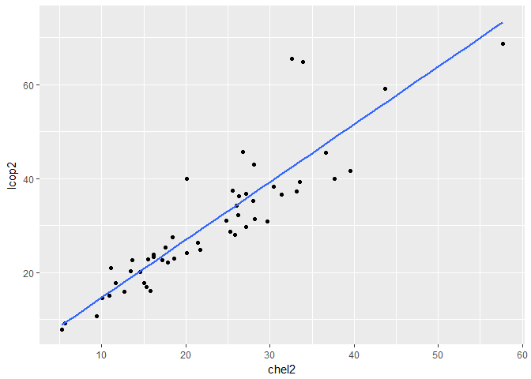<!-- -->

### Korelacja: fbar-totaln (-0.51)

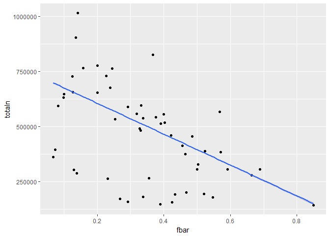<!-- -->

### Korelacja: chel1-cumf (0.82)

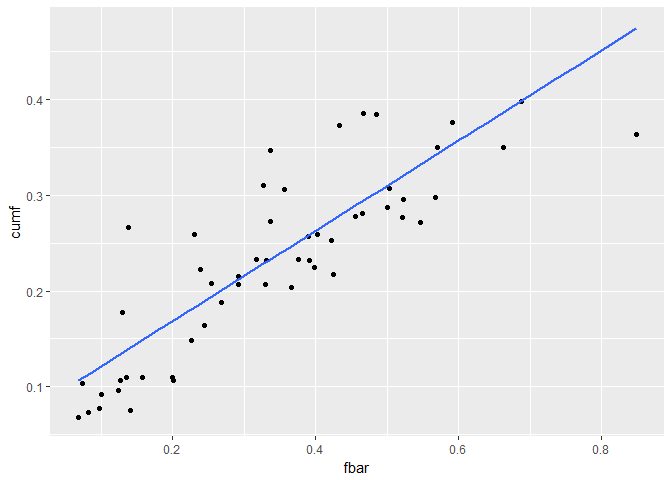<!-- -->

### Korelacja: totaln-cumf (-0.71)

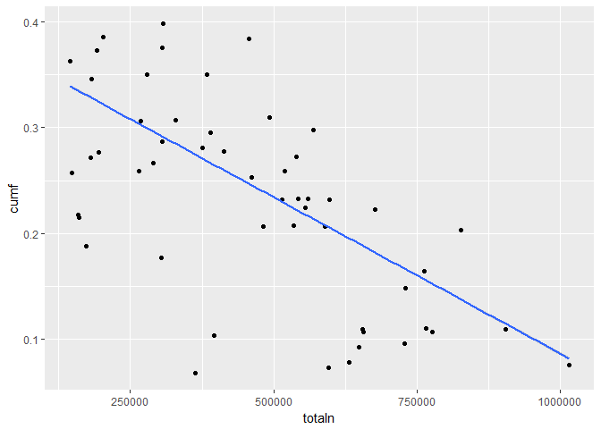<!-- -->

## Zmiana rozmiaru śledzi w czasie

<!--html_preserve--><div id="htmlwidget-97b95e83606b02886e17" style="width:672px;height:480px;" class="plotly html-widget"></div>
<script type="application/json" data-for="htmlwidget-97b95e83606b02886e17">{"x":{"data":[{"x":[0,1,2,3,4,5,6,7,8,9,10,11,12,13,14,15,16,17,18,19,20,21,22,23,24,25,26,27,28,29,30,31,32,33,34,35,36,37,38,39,40,41,42,43,44,45,46,47,48,49,50,51,52,53,54,55,56,57,58,59,60],"y":[24.3406368984533,25.1494220026421,24.9049498846181,25.0424021274739,25.2163529625853,25.161136490497,25.3775925709695,25.4953029904014,25.9180505279783,25.6906204090406,26.0581500763206,26.3129696324497,26.0367766908176,26.2769871662739,26.3092305273835,26.5879140434525,26.7243659888848,26.8865756337922,26.8962530849702,26.9186054883293,27.0462261661703,26.3862659973515,26.1751334640924,26.0300762268822,26.8101197035848,26.0409044423046,25.8078108256456,26.6363007752188,26.2918374595285,24.8476976189229,25.5623348245133,25.2938499630697,25.6074504646344,25.6756658827557,25.7151310709617,25.6451537614739,25.2667589674498,25.0971796325928,24.9751608086531,25.1171455779226,25.385373575416,25.1229444409161,24.9930684001753,24.9263525587027,24.9723080428093,24.6621349274357,24.6326955579466,24.6378321999147,24.5229220721649,24.789264142206,24.0764504338478,24.4008423468225,24.0792560226525,24.3378580595393,24.0988583308515,23.952311201542,24.5339727964413,23.9218519281049,23.9771084826151,24.074304988289,24.25],"text":["period: 0<br>length: 24.34","period: 1<br>length: 25.15","period: 2<br>length: 24.9","period: 3<br>length: 25.04","period: 4<br>length: 25.22","period: 5<br>length: 25.16","period: 6<br>length: 25.38","period: 7<br>length: 25.5","period: 8<br>length: 25.92","period: 9<br>length: 25.69","period: 10<br>length: 26.06","period: 11<br>length: 26.31","period: 12<br>length: 26.04","period: 13<br>length: 26.28","period: 14<br>length: 26.31","period: 15<br>length: 26.59","period: 16<br>length: 26.72","period: 17<br>length: 26.89","period: 18<br>length: 26.9","period: 19<br>length: 26.92","period: 20<br>length: 27.05","period: 21<br>length: 26.39","period: 22<br>length: 26.18","period: 23<br>length: 26.03","period: 24<br>length: 26.81","period: 25<br>length: 26.04","period: 26<br>length: 25.81","period: 27<br>length: 26.64","period: 28<br>length: 26.29","period: 29<br>length: 24.85","period: 30<br>length: 25.56","period: 31<br>length: 25.29","period: 32<br>length: 25.61","period: 33<br>length: 25.68","period: 34<br>length: 25.72","period: 35<br>length: 25.65","period: 36<br>length: 25.27","period: 37<br>length: 25.1","period: 38<br>length: 24.98","period: 39<br>length: 25.12","period: 40<br>length: 25.39","period: 41<br>length: 25.12","period: 42<br>length: 24.99","period: 43<br>length: 24.93","period: 44<br>length: 24.97","period: 45<br>length: 24.66","period: 46<br>length: 24.63","period: 47<br>length: 24.64","period: 48<br>length: 24.52","period: 49<br>length: 24.79","period: 50<br>length: 24.08","period: 51<br>length: 24.4","period: 52<br>length: 24.08","period: 53<br>length: 24.34","period: 54<br>length: 24.1","period: 55<br>length: 23.95","period: 56<br>length: 24.53","period: 57<br>length: 23.92","period: 58<br>length: 23.98","period: 59<br>length: 24.07","period: 60<br>length: 24.25"],"key":null,"type":"scatter","mode":"lines","name":"","line":{"width":1.88976377952756,"color":"rgba(0,0,0,1)","dash":"solid"},"hoveron":"points","showlegend":false,"xaxis":"x","yaxis":"y","hoverinfo":"text"}],"layout":{"margin":{"t":26.2283105022831,"r":7.30593607305936,"b":40.1826484018265,"l":37.2602739726027},"plot_bgcolor":"rgba(235,235,235,1)","paper_bgcolor":"rgba(255,255,255,1)","font":{"color":"rgba(0,0,0,1)","family":"","size":14.6118721461187},"xaxis":{"domain":[0,1],"type":"linear","autorange":false,"tickmode":"array","range":[-3,63],"ticktext":["0","20","40","60"],"tickvals":[0,20,40,60],"ticks":"outside","tickcolor":"rgba(51,51,51,1)","ticklen":3.65296803652968,"tickwidth":0.66417600664176,"showticklabels":true,"tickfont":{"color":"rgba(77,77,77,1)","family":"","size":11.689497716895},"tickangle":-0,"showline":false,"linecolor":null,"linewidth":0,"showgrid":true,"gridcolor":"rgba(255,255,255,1)","gridwidth":0.66417600664176,"zeroline":false,"anchor":"y","title":"period","titlefont":{"color":"rgba(0,0,0,1)","family":"","size":14.6118721461187},"hoverformat":".2f"},"yaxis":{"domain":[0,1],"type":"linear","autorange":false,"tickmode":"array","range":[23.7656332162017,27.2024448780736],"ticktext":["24","25","26","27"],"tickvals":[24,25,26,27],"ticks":"outside","tickcolor":"rgba(51,51,51,1)","ticklen":3.65296803652968,"tickwidth":0.66417600664176,"showticklabels":true,"tickfont":{"color":"rgba(77,77,77,1)","family":"","size":11.689497716895},"tickangle":-0,"showline":false,"linecolor":null,"linewidth":0,"showgrid":true,"gridcolor":"rgba(255,255,255,1)","gridwidth":0.66417600664176,"zeroline":false,"anchor":"x","title":"length","titlefont":{"color":"rgba(0,0,0,1)","family":"","size":14.6118721461187},"hoverformat":".2f"},"shapes":[{"type":"rect","fillcolor":null,"line":{"color":null,"width":0,"linetype":[]},"yref":"paper","xref":"paper","x0":0,"x1":1,"y0":0,"y1":1}],"showlegend":false,"legend":{"bgcolor":"rgba(255,255,255,1)","bordercolor":"transparent","borderwidth":1.88976377952756,"font":{"color":"rgba(0,0,0,1)","family":"","size":11.689497716895}},"hovermode":"closest"},"source":"A","config":{"modeBarButtonsToAdd":[{"name":"Collaborate","icon":{"width":1000,"ascent":500,"descent":-50,"path":"M487 375c7-10 9-23 5-36l-79-259c-3-12-11-23-22-31-11-8-22-12-35-12l-263 0c-15 0-29 5-43 15-13 10-23 23-28 37-5 13-5 25-1 37 0 0 0 3 1 7 1 5 1 8 1 11 0 2 0 4-1 6 0 3-1 5-1 6 1 2 2 4 3 6 1 2 2 4 4 6 2 3 4 5 5 7 5 7 9 16 13 26 4 10 7 19 9 26 0 2 0 5 0 9-1 4-1 6 0 8 0 2 2 5 4 8 3 3 5 5 5 7 4 6 8 15 12 26 4 11 7 19 7 26 1 1 0 4 0 9-1 4-1 7 0 8 1 2 3 5 6 8 4 4 6 6 6 7 4 5 8 13 13 24 4 11 7 20 7 28 1 1 0 4 0 7-1 3-1 6-1 7 0 2 1 4 3 6 1 1 3 4 5 6 2 3 3 5 5 6 1 2 3 5 4 9 2 3 3 7 5 10 1 3 2 6 4 10 2 4 4 7 6 9 2 3 4 5 7 7 3 2 7 3 11 3 3 0 8 0 13-1l0-1c7 2 12 2 14 2l218 0c14 0 25-5 32-16 8-10 10-23 6-37l-79-259c-7-22-13-37-20-43-7-7-19-10-37-10l-248 0c-5 0-9-2-11-5-2-3-2-7 0-12 4-13 18-20 41-20l264 0c5 0 10 2 16 5 5 3 8 6 10 11l85 282c2 5 2 10 2 17 7-3 13-7 17-13z m-304 0c-1-3-1-5 0-7 1-1 3-2 6-2l174 0c2 0 4 1 7 2 2 2 4 4 5 7l6 18c0 3 0 5-1 7-1 1-3 2-6 2l-173 0c-3 0-5-1-8-2-2-2-4-4-4-7z m-24-73c-1-3-1-5 0-7 2-2 3-2 6-2l174 0c2 0 5 0 7 2 3 2 4 4 5 7l6 18c1 2 0 5-1 6-1 2-3 3-5 3l-174 0c-3 0-5-1-7-3-3-1-4-4-5-6z"},"click":"function(gd) { \n        // is this being viewed in RStudio?\n        if (location.search == '?viewer_pane=1') {\n          alert('To learn about plotly for collaboration, visit:\\n https://cpsievert.github.io/plotly_book/plot-ly-for-collaboration.html');\n        } else {\n          window.open('https://cpsievert.github.io/plotly_book/plot-ly-for-collaboration.html', '_blank');\n        }\n      }"}],"modeBarButtonsToRemove":["sendDataToCloud"]},"base_url":"https://plot.ly"},"evals":["config.modeBarButtonsToAdd.0.click"],"jsHooks":[]}</script><!--/html_preserve-->

## Regresor

### Podział danych
Dane podzielono na zbiór treningowy i testowy w stosunku 7:3. Przed podziałem przeprowadzono standaryzację danych.


### Utworzenie modelu i walidacja
Do utworzenia modelu wykorzystano algorytm kNN z użyciem Repeated Cross Validation. Przeprowadzone próby wykazały, że zbudowany przez niego model najlepiej radzi sobie z predykcją długości śledzia. Niewiele gorsze wyniki dawał algorytm Stochastic Gradient boosting oraz Random Forest. Ten ostatni jednak nie sprawdza dobrze się przy analizie ważności atrybutów.


```r
set.seed(111)

ctrl <- trainControl(method="repeatedcv", number = 2,  repeats = 5)

fit <- train(length ~ xmonth+cfin1+cfin2+chel1+chel2+lcop1+lcop2+fbar+recr+cumf+totaln+sst+sal+nao,
             data = training,
             method = "knn",
             trControl = ctrl)

predictions <- predict(fit, testing)
rmse <- sqrt(mean((testing$length - predictions)^2))
rSquare <- 1 - (sum((testing$length-predictions)^2)/sum((testing$length-mean(testing$length))^2))
```

Wskaźniki RMSE i R^2


```r
measures <- rbind(
    cbind(dane="treningowe", fit$results[1,c("RMSE", "Rsquared")]), 
    data.frame(dane="testowe", RMSE=rmse, Rsquared=rSquare))
kable(measures)
```


dane              RMSE    Rsquared
-----------  ---------  ----------
treningowe    1.151145   0.5159390
testowe       1.137661   0.5252678

### Analiza ważności atrybutów

atrybut        ważność
--------  ------------
sst        100.0000000
nao         32.4529105
fbar        31.1548415
lcop1       27.7959103
chel1       23.9204314
totaln       5.2849797
cfin2        5.1501150
cfin1        3.2189325
lcop2        1.2124932
sal          0.7185442
chel2        0.1428931
xmonth       0.0595386
recr         0.0222737
cumf         0.0000000

Z przeprowadzonej analizy wynika, że najważniejszym atrybutem jest sst, czyli temperatura przy powierzchni wody. Powyższą zależność można było już zauważyć przy analizie korelacji, gdzie sst okazało się być najlepiej skorelowanym (ujemnie) atrybutem z length.

## Regresor dla danych pogrupowanych po atrybucie period

Alternatywnie podjęto próbę nauczenia regresora na zredukowanych danych. Korzystając z wcześniej dodanego atrybutu period pogrupowano dane treningowe po wszystkich atrybutach za wyjątkiem X i length, a następnie wyznaczono wartość średnią dla length dla każdej grupy: 


```r
groupedByPeriod <- training %>% 
  group_by(period, xmonth, cfin1, cfin2, chel1, chel2, lcop1, lcop2, fbar, recr, cumf, totaln, sst, sal, nao) %>%
  summarise(length=mean(length), n=max(X)) %>% 
  select(n, length, everything())

training <- data.frame(groupedByPeriod)
```

Takie grupowanie pozwoliło zredukować liczność zbioru treningowego do zaledwie 3598 wierszy. Intuicja stojąca za takim podejściem jest nastepująca: skoro dane w grupie różnią się jedynie wartością atrybutu length to po wyliczeniu średniej dla tego atrybutu w grupie nie tracimy żadnej informacji, natomiast zredukowany rozmiar zbioru pozwoli wielokrotnie przyśpieszyć działanie algorytmu uczącego. 

### Utworzenie modelu i walidacja

W tym przypadku do utworzenia modelu użyto identycznego algorytmu z identycznymi parametrami jak poprzednio.


```r
set.seed(111)

ctrl <- trainControl(method="repeatedcv", number = 2,  repeats = 5)

fit <- train(length ~ xmonth+cfin1+cfin2+chel1+chel2+lcop1+lcop2+fbar+recr+cumf+totaln+sst+sal+nao,
             data = training,
             method = "knn",
             trControl = ctrl)

predictions <- predict(fit, testing)
rmse <- sqrt(mean((testing$length - predictions)^2))
rSquare <- 1 - (sum((testing$length-predictions)^2)/sum((testing$length-mean(testing$length))^2))
```

Wskaźniki RMSE i R^2


```r
measures <- rbind(
    cbind(dane="treningowe", fit$results[1,c("RMSE", "Rsquared")]), 
    data.frame(dane="testowe", RMSE=rmse, Rsquared=rSquare))
kable(measures)
```


dane               RMSE    Rsquared
-----------  ----------  ----------
treningowe    0.8187921   0.6467307
testowe       1.1619220   0.5048046

Jak widać wskaźniki dla danych treningowych znacznie się polepszyły. Niestety dla danych testowych otrzymaliśmy minimalnie gorsze rezultaty. Podejście to nie poskutkowało uzyskaniem lepszych wyników, ale zgodnie z oczekiwaniem model udało się zbudować wielokrotnie szybciej (o rząd wielkości). Dla całego zbioru danych uczenie zajmuje ok. 3 minut, natomiast dla zbioru zredukowanego zaledwie 2 sekundy. Oczywiście dla tak niewielkiego zbioru i stosunkowo niedługiego czasu przetwarzania nie warto tracić na dokładności wyników kosztem kilku minut oczekiwania. Można sobie jednak wyobrazić sytuacje gdzie wielokrotne zredukowanie rozmiaru problemu przy stosunkowo niedużej utracie dokładności jest wysoce pożądane.

### Analiza ważności atrybutów

atrybut        ważność
--------  ------------
sst        100.0000000
nao         26.8032717
lcop1       25.0841973
fbar        21.4331680
chel1       21.2344658
totaln       3.8565149
cfin2        3.2549219
cfin1        2.8726389
sal          1.8629307
lcop2        1.5705551
cumf         0.5472577
recr         0.1201673
xmonth       0.0014616
chel2        0.0000000

W tym przypadku podobnie jak poprzednio najważniejszym atrybutem okazał się sst. Dla pozostałych atrybutów wartości ważności nie różnią się znacząco.
